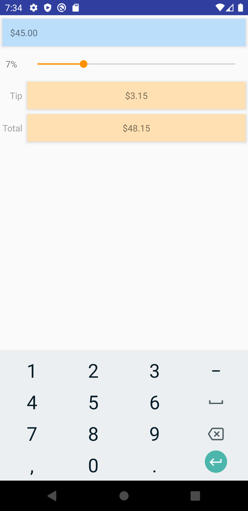

# Tip Calculator
### Description
A tip calculator used to calculate tips given an amount of money. (Alternatively, it can be used to calculate sales tax.)

### How to use the program:
- Enter in the total value you want to tip in "Enter Amount"
- Slide the scroll to the tip precentage that you are looking to calculate 
- The result of the calculation should then show on the screen includeing the tip amount
and the total amount

### How to try it on your computer
- You will need to have Android Studio Installed, either on Linux, Windows or Mac
- Git clone this Repository, find the `.apk` file located in the `build` directory
- Drag the `app-debug.apk` file to an an Android AVD Emulator Instance
- Enjoy the app!

